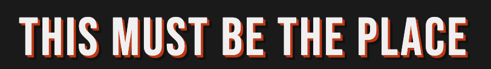

# this-must-be-the-place--mural--colorblock-fx


A canvas-based sign-painted block letter effect — white face, red mid-layer, black depth — inspired by the ["This Must Be The Place"](https://www.thebanner.com/community/local-news/this-must-be-the-place-mural-painted-espo-DMKP5D3IJNCWZEDL6NW6JOGKCE/) mural.




## Quick start

No build step. Open either file directly in a browser.


## How the effect works

Three canvas draw passes, back to front:

```
1. Deep layer  — drawn at offset (i, i) for i = depth…1     → black
2. Mid layer   — drawn at offset (i, i) for i = depth×0.55…1 → red
3. Face layer  — drawn at (0, 0)                             → white
```

This simulates physically mounted block letters casting a red then black shadow, the same technique used in hand-painted signs and murals.

## Embedding in your own page

Copy `embed.html` or paste the snippet below. The only dependency is the [Bebas Neue](https://fonts.google.com/specimen/Bebas+Neue) Google Font (falls back to Impact).

```html
<link href="https://fonts.googleapis.com/css2?family=Bebas+Neue&display=swap" rel="stylesheet">

<div style="background:#1a1a1a;padding:1rem;border-radius:8px;">
  <canvas id="sign"></canvas>
</div>

<script>
blockLetterFX(document.getElementById('sign'), 'YOUR TEXT HERE');
</script>

<script src="block-letter-fx.js"></script>
```

## Options

```js
blockLetterFX(canvas, text, {
  faceColor:  '#f0f0f0',   // letter face
  midColor:   '#cc2200',   // red mid-layer
  deepColor:  '#111111',   // black depth
  depthPct:   0.09,        // extrusion as fraction of font size (0–0.25)
  spacing:    2,           // letter-spacing in px
  padding:    28,          // horizontal padding in px
})
```

## License

MIT
